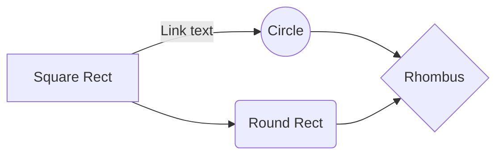

#  rust_ffi
```
## ./test01

  ./test01/a.c
  ./test01/build.sh
  ./test01/main.c
## ./test01_shared

  ./test01_shared/a.c
  ./test01_shared/build.sh
  ./test01_shared/main.c
## ./test01_static
  ./test01_static/a.c
  ./test01_static/build.sh
  ./test01_static/main.c
## ./test02_shared
  ./test02_shared/a.c
  ./test02_shared/build.sh
  ./test02_shared/main.rs
## ./test02_static
  ./test02_static/a.c
  ./test02_static/build.sh
  ./test02_static/main.rs
```
## ./test01
Synchronization is one of the biggest features of StackEdit. It enables you to synchronize any file in your workspace with other files stored in your **Google Drive**, your **Dropbox** and your **GitHub** accounts. This allows you to keep writing on other devices, collaborate with people you share the file with, integrate easily into your workflow... The synchronization mechanism takes place every minute in the background, downloading, merging, and uploading file modifications.

There are two types of synchronization and they can complement each other:

- The workspace synchronization will sync all your files, folders and settings automatically. This will allow you to fetch your workspace on any other device.
> To start syncing your workspace, just sign in with Google in the menu.

- The file synchronization will keep one file of the workspace synced with one or multiple files in **Google Drive**, **Dropbox** or **GitHub**.
> Before starting to sync files, you must link an account in the **Synchronize** sub-menu.


--------------------------------------------------------------------  ./test01/a.c

```c
#include <stdio.h>

void func_a() {
  printf("This is func_a!\n");
}
```

---------------------------------------------------------------  ./test01/build.sh

```sh
 gcc -c a.c 
 gcc -c main.c 
 gcc main.o a.o -o test1.exe
 test1.exe
```

-----------------------------------------------------------------  ./test01/main.c

```c
void func_a();

int main() {
  func_a();
}
```
## ./test01_shared
And this will produce a flow chart:




-------------------------------------------------------------  ./test01_shared/a.c

```c
#include <stdio.h>

void func_a() {
  printf("This is func_a!\n");
}
```

--------------------------------------------------------  ./test01_shared/build.sh

```sh
 gcc -shared a.c -o liba.so -fPIC
 gcc main.c  -o test1.exe -L. -la
 export LD_LIBRARY_PATH=.:$LD_LIBRARY_PATH 
 test1.exe
```

----------------------------------------------------------  ./test01_shared/main.c

```c
void func_a();

int main() {
  func_a();
}
```
## ./test01_static

-------------------------------------------------------------  ./test01_static/a.c

```c
#include <stdio.h>

void func_a() {
  printf("This is func_a!\n");
}
```

--------------------------------------------------------  ./test01_static/build.sh

```sh
 gcc -c a.c 
 ar crs liba.a a.o
 gcc main.c  -o test1.exe -L. -la
 test1.exe
```

----------------------------------------------------------  ./test01_static/main.c

```c
void func_a();

int main() {
  func_a();
}
```
## ./test02_shared

-------------------------------------------------------------  ./test02_shared/a.c

```c
#include <stdio.h>

void func_a() {
  printf("This is func_a!\n");
}
```

--------------------------------------------------------  ./test02_shared/build.sh

```sh
 gcc -shared a.c -o liba.so -fPIC
 nm liba.so
 rustc -o test_rs.exe main.rs -L. -la
 export LD_LIBRARY_PATH=.:$LD_LIBRARY_PATH
 test_rs.exe
```

---------------------------------------------------------  ./test02_shared/main.rs

```rust
extern "C" {
    fn func_a();
}

fn main() {
    unsafe {
        func_a();
    }
}
```
## ./test02_static

-------------------------------------------------------------  ./test02_static/a.c

```c
#include <stdio.h>

void func_a() {
  printf("This is func_a!\n");
}
```

--------------------------------------------------------  ./test02_static/build.sh

```sh
 gcc -c a.c  -fPIC
 ar crs liba.a a.o
 rustc -o test_rs.exe main.rs -L. -la
 test_rs.exe
```

---------------------------------------------------------  ./test02_static/main.rs

```rust
extern "C" {
    fn func_a();
}

fn main() {
    unsafe {
        func_a();
    }
}
```
